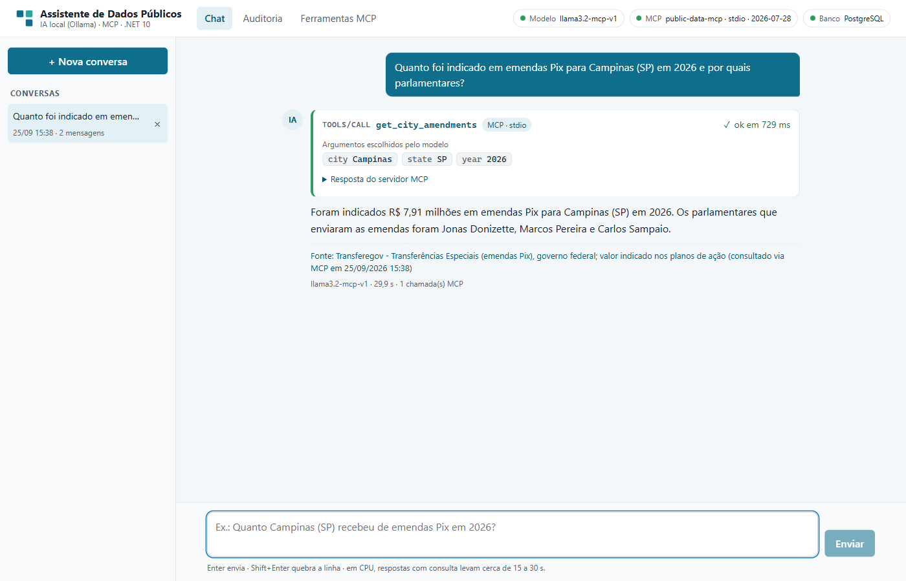
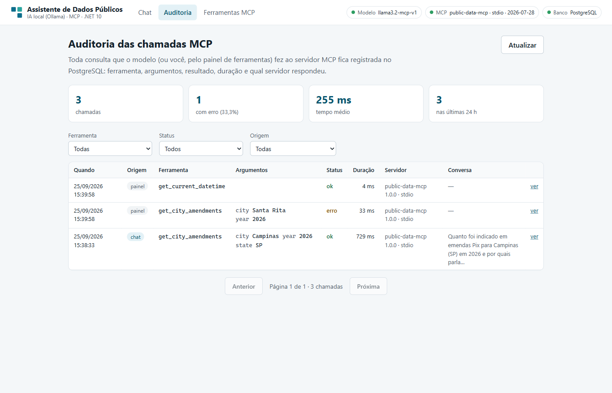
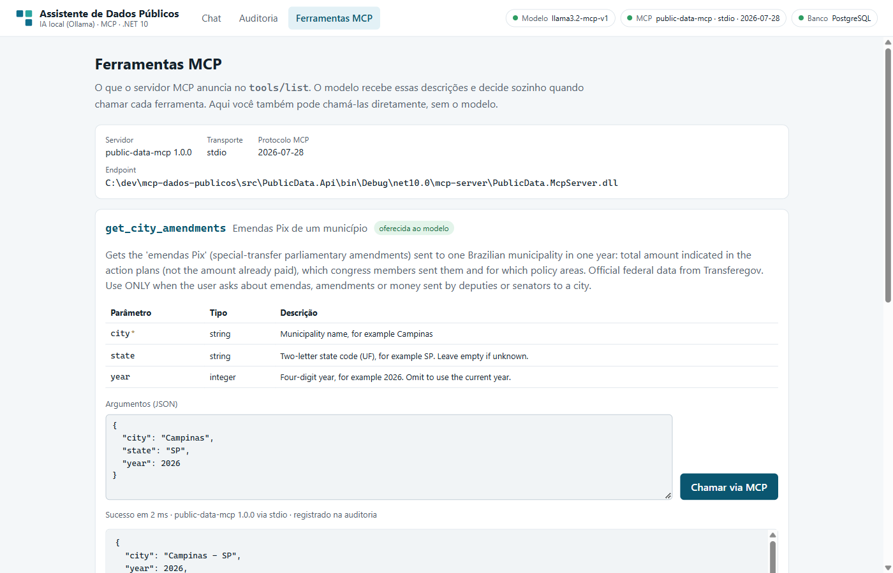
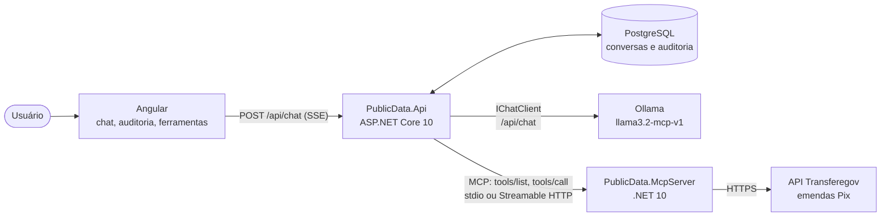
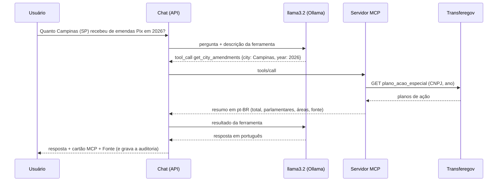

# Assistente de Dados Públicos: IA local + servidor MCP em .NET 10

[](https://github.com/guiicauaaa/mcp-dados-publicos/actions/workflows/ci.yml)

Um chat em que o **llama3.2, rodando localmente no Ollama**, decide sozinho quando precisa de dados oficiais.
Quando precisa, chama uma ferramenta de um **servidor MCP em .NET 10**, que consulta a **API pública do
Transferegov** (valor indicado em emendas Pix para cada município). A resposta volta com os números e a
fonte, e **cada chamada MCP fica visível no chat e registrada numa trilha de auditoria** no PostgreSQL,
inclusive quando a resposta é cancelada ou falha.



| O que o desafio pede | Onde está |
|---|---|
| Modelo de IA rodando localmente (LLM via Ollama, llama3.2 "ou similar") | `llama3.2`, usado como `llama3.2-mcp-v1`: os mesmos pesos, com o template de ferramentas corrigido ([por quê](docs/decisoes.md#adr-05--modelo-derivado-llama32-mcp-v1-mesmos-pesos-template-corrigido)) |
| Servidor MCP em .NET 10 com pelo menos uma ferramenta que consulta uma API externa | [`src/PublicData.McpServer`](src/PublicData.McpServer): `get_city_amendments` (Transferegov) e `get_current_datetime`, com o SDK oficial 2.2.0 |
| Cliente de chat integrado ao LLM + MCP | Web em Angular ([`src/PublicData.Web`](src/PublicData.Web)) sobre a API ([`src/PublicData.Api`](src/PublicData.Api)), e também um console ([`src/PublicData.Chat`](src/PublicData.Chat)) |
| Usuário → Chat → Modelo → MCP → API externa → resposta | Veja [Arquitetura](#arquitetura) e [Como ver que a consulta passou pelo MCP](#como-ver-que-a-consulta-passou-pelo-mcp) |

## Rodar

Pré-requisito comum: **[Ollama](https://ollama.com/download)** (testado com 0.34.4) e o modelo:

```bash
ollama pull llama3.2
ollama run llama3.2 "Responda em uma frase: você está rodando localmente?"   # confere que o modelo responde
```

Na primeira execução, o app cria sozinho o `llama3.2-mcp-v1` a partir do `llama3.2`, em segundos e sem
novo download. Se preferir criar à mão: `ollama create llama3.2-mcp-v1 -f ollama/Modelfile`.

### Opção A: Docker Compose (recomendada)

Precisa de Docker. Sobe PostgreSQL, o servidor MCP (Streamable HTTP) e a API com o frontend:

```bash
git clone https://github.com/guiicauaaa/mcp-dados-publicos.git
cd mcp-dados-publicos
docker compose up -d --build
```

Abra **http://localhost:8080**. O compose usa o Ollama da sua máquina (`host.docker.internal:11434`), o
que funciona direto no Docker Desktop (Windows e macOS).

- **Ollama também em container**, o caminho mais simples no Linux (inferência em CPU e download de 2 GB
  na primeira vez): `docker compose -f docker-compose.yml -f docker-compose.ollama.yml up -d --build`.
- **Linux com o Ollama da máquina:** o serviço systemd do Ollama escuta só em `127.0.0.1`. Para os
  containers o alcançarem, rode `sudo systemctl edit ollama`, acrescente `[Service]` e
  `Environment="OLLAMA_HOST=0.0.0.0"`, e depois `sudo systemctl restart ollama`. Isso expõe a API do Ollama
  (sem autenticação) na rede local: use um firewall ou prefira o Ollama em container.

### Opção B: sem Docker

Precisa de [.NET SDK 10](https://dotnet.microsoft.com/download), Node 24 e PostgreSQL local (usuário
`postgres`, senha `postgres`; ou ajuste `ConnectionStrings:Default`). O banco é criado pelas migrations.
Os comandos abaixo, um por linha, funcionam em bash, zsh, cmd e PowerShell:

```bash
cd src/PublicData.Web
npm ci
npm run build
cd ../..
dotnet run --project src/PublicData.Api
```

O `npm run build` gera o frontend em `src/PublicData.Api/wwwroot`, e a API sobe em
**http://localhost:5080**.

Aqui o servidor MCP roda em **stdio**, como processo filho da API, igual ao repositório de exemplo. Para
desenvolver o frontend com hot reload: `npm start` em `src/PublicData.Web` (http://localhost:4200, com
proxy para a API).

### Opção C: console (o mínimo, sem banco nem frontend)

```bash
dotnet run --project src/PublicData.Chat
dotnet run --project src/PublicData.Chat -- --check
dotnet run --project src/PublicData.Chat -- --smoke
```

O primeiro abre a conversa no terminal. O `--check` diagnostica o MCP e o Transferegov (sem precisar do
Ollama) e depois o Ollama e o modelo, com código de saída 0 a 4. O `--smoke` roda o roteiro de 24 perguntas
contra o modelo real. `-- --help` lista as opções.

## Perguntas para testar

Dados conferidos em 25/09/2026 (os dados oficiais mudam com o tempo):

| Pergunta | O que acontece |
|---|---|
| Olá! O que você consegue fazer? | Responde **sem** chamar ferramenta. |
| Quanto foi indicado em emendas Pix para Campinas (SP) em 2026 e por quais parlamentares? | Chama `get_city_amendments`: "Foram indicados R$ 7,91 milhões…"; Jonas Donizette, Marcos Pereira e Carlos Sampaio. |
| E em 2025? | Nova chamada com Campinas (tirada do contexto) e 2025: R$ 12,50 milhões. |
| Quanto Santa Rita recebeu de emendas Pix em 2026? | O servidor avisa que há Santa Rita-MA e Santa Rita-PB, e o modelo pergunta o estado. |
| Que dia é hoje? | Responde sem ferramenta: a data de Brasília vai no system prompt. |

O dado é o **valor indicado** nos planos de ação, não o valor pago. Perguntar com "recebeu" também funciona,
mas o modelo tende a repetir o verbo da pergunta. Por isso toda resposta com dados termina com a linha
"Fonte: … valor indicado nos planos de ação", montada pelo cliente a partir do resultado MCP.

Em CPU, uma pergunta com consulta leva cerca de 15 a 30 s, porque uma chamada de ferramenta exige duas
passadas do modelo. Os tempos medidos estão em [Resultado com o modelo real](#resultado-com-o-modelo-real).

## Como ver que a consulta passou pelo MCP

- **No chat:** cada chamada vira um cartão `tools/call` com os argumentos escolhidos pelo modelo, a
  duração e a resposta do servidor MCP. Pergunta sem cartão = o modelo decidiu não buscar dados.
- **No cabeçalho:** o servidor (`public-data-mcp`), o transporte (stdio ou http) e o protocolo MCP
  negociado (2026-07-28).
- **Em Ferramentas MCP:** o `tools/list` que o servidor anuncia, a chamada direta sem o modelo e o log do
  processo servidor ("Transferegov: consultando Campinas-SP…").
- **Em Auditoria:** todas as chamadas, gravadas no PostgreSQL, com argumentos, resultado, duração e servidor.
- **Na resposta:** a linha "Fonte: … (consultado via MCP em …)" é montada a partir do resultado MCP, não pelo modelo.

| Auditoria | Ferramentas MCP |
|---|---|
|  |  |

## Arquitetura





| Projeto | Responsabilidade |
|---|---|
| `PublicData.McpServer` | Servidor MCP (stdio e Streamable HTTP): `get_city_amendments` e `get_current_datetime`, catálogo embutido dos 5.570 municípios, cliente Transferegov com resiliência e cache. |
| `PublicData.Chat.Core` | Conexão MCP, pipeline Microsoft.Extensions.AI + OllamaSharp, modelo derivado, rastreio das chamadas, reparo de chamadas malformadas e o turno do chat. |
| `PublicData.Api` | API REST: chat em SSE, conversas, auditoria, status e chamada direta de ferramenta; EF Core + PostgreSQL; serve o Angular. OpenAPI em `/openapi/v1.json` e documentação em `/docs`. |
| `PublicData.Web` | Angular 22 (standalone, signals, zoneless): chat com cartões MCP em tempo real, auditoria e ferramentas. |
| `PublicData.Chat` | Console: conversa, `--check` e `--smoke`. |
| `tests/PublicData.Tests` | xUnit v3: unitários com respostas reais do Transferegov, integração com o servidor MCP real (stdio e HTTP), orquestração com modelo roteirizado e API com PostgreSQL. |

## A ferramenta MCP

`get_city_amendments(city, state?, year?)`: valor indicado em emendas Pix (transferências especiais)
para um município em um ano. É o valor dos planos de ação, não o valor já pago. O servidor resolve o
município sem rede (snapshot SICONFI embutido; tolera acento, caixa e "Campinas - SP" no nome), consulta o
Transferegov **pelo CNPJ** com `select` explícito (sem dados bancários), descarta planos IMPEDIDOS (seriam
contados em dobro) e devolve um JSON pequeno já formatado:

```json
{"city":"Campinas - SP","year":2026,"total_indicated":"R$ 7,91 milhões","amendments":5,"blocked_amendments":3,
 "sent_by_parliamentarian":[{"name":"Jonas Donizette","amount":"R$ 5,52 milhões","amendments":3}, "…"],
 "by_policy_area":[{"name":"Educação","amount":"R$ 5,52 milhões","amendments":3}, "…"],
 "source":"Transferegov - Transferências Especiais (emendas Pix), governo federal; valor indicado nos planos de ação",
 "note":"Consulta concluída. …","queried_at":"25/09/2026 14:15"}
```

Argumentos inválidos voltam como erro da ferramenta, com uma mensagem que o modelo repassa ("UF 'XX'
inválida…", "Há mais de um município chamado Santa Rita… Informe o estado.", "Ano 2015 fora do
intervalo…"). Se a API estiver fora do ar: 2 novas tentativas, timeout total de 20 s e mensagem amigável.

`get_current_datetime`: data e hora de Brasília, o equivalente ao `get_time` do exemplo de referência.
Fica disponível para outros clientes MCP e no painel, mas **não é oferecida ao llama3.2** (ADR-06).

## Decisões técnicas

Resumo. O contexto e os números de cada uma estão em [docs/decisoes.md](docs/decisoes.md).

- **SDK oficial de MCP 2.2.0** nos dois lados (spec 2026-07-28), com **stdio** (local) e **Streamable
  HTTP** (Docker). Nada de JSON-RPC escrito à mão.
- **Microsoft.Extensions.AI + OllamaSharp**, com `FunctionInvokingChatClient` limitado a 3 iterações.
  O pacote `Microsoft.Extensions.AI.Ollama` está deprecado.
- **Modelo derivado do llama3.2.** O template oficial manda "responda com JSON de função" sempre que há
  ferramentas. Trocar só esse parágrafo levou as decisões certas de **6/18 para 18/18**, com os mesmos pesos.
- **Pensado para um modelo de 3B:** uma ferramenta oferecida, data no system prompt, resultado pequeno e
  já formatado, nomes de campo que guiam a redação, histórico só com texto, reparo de chamadas
  malformadas e a Fonte montada pelo cliente.
- **Trilha de auditoria** de toda chamada MCP no PostgreSQL: o que a IA consultou fica registrado.
- **Transferegov** entre as 8 APIs públicas testadas: sem chave, rápida e com filtro no servidor
  ([comparação](docs/decisoes.md#adr-04--transferegov-emendas-pix-como-api-externa)).

## Resultado com o modelo real

O `--smoke` roda 24 perguntas contra o llama3.2 real: 6 do roteiro do vídeo e 18 de controle, das quais 14
**não** devem chamar ferramenta.

| Medição (25/09/2026, CPU) | Resultado |
|---|---|
| Template original do llama3.2 | 6/18 decisões certas no controle (chamava ferramenta até para "oi") |
| Smoke final, 3 rodadas | **72/72** decisões e resultados certos |
| Roteiro do vídeo, 5 rodadas | **20/20** |
| Tempo por pergunta | 11 a 39 s com ferramenta (mediana 20 s); 1 a 27 s sem (mediana 4 s) |

Tabela completa, com os argumentos de cada chamada: [docs/smoke-llama32.md](docs/smoke-llama32.md).
Como cada ajuste foi medido: [docs/decisoes.md](docs/decisoes.md#adr-05--modelo-derivado-llama32-mcp-v1-mesmos-pesos-template-corrigido).

## Testes e CI/CD

.NET (sem Ollama e sem internet), na raiz:

```bash
dotnet test
```

Angular:

```bash
cd src/PublicData.Web
npm ci
npm run test:ci
```

- **.NET (xUnit v3, Microsoft Testing Platform):** unitários com respostas reais do Transferegov gravadas,
  integração com o servidor MCP real por stdio e por HTTP, o pipeline de produção com um modelo roteirizado
  no lugar do Ollama e a API de ponta a ponta com PostgreSQL. Os testes da API usam um banco descartável
  quando `PUBLICDATA_TEST_DB` está definida (ex.: `Host=localhost;Username=postgres;Password=postgres`);
  sem ela, são pulados.
- **Angular (Vitest):** parser de SSE, formatação da resposta, cartão MCP e cabeçalho de status.
- **CI** ([ci.yml](.github/workflows/ci.yml)): .NET no Linux com PostgreSQL e no Windows, Angular, e o
  Docker Compose de verdade com smoke test (MCP por HTTP entre containers, auditoria e frontend).
- **CD** ([cd.yml](.github/workflows/cd.yml)): com o CI verde num push na `main`, publica as imagens `app`
  e `mcp-server` no GitHub Container Registry (tags `latest` e SHA). Não há servidor para implantar, porque o
  modelo roda no Ollama de quem usa. Com os pacotes públicos, `docker compose pull` seguido de
  `docker compose up -d` dispensa o build local.

## Configuração

API (`src/PublicData.Api/appsettings.json`, ou variáveis de ambiente com `__`, ex.: `Chat__Model`):

| Chave | Padrão | Uso |
|---|---|---|
| `ConnectionStrings:Default` | PostgreSQL local | Histórico e auditoria. |
| `Chat:OllamaBaseUrl` | `http://localhost:11434` | Endereço do Ollama. |
| `Chat:Model` | `llama3.2-mcp-v1` | Modelo. `llama3.2` roda o original; `qwen3:4b-instruct` (2,5 GB) é a alternativa sugerida. |
| `Chat:ExposedTools` | `["get_city_amendments"]` | Ferramentas oferecidas ao modelo. Para oferecer também a de data/hora: `Chat__ExposedTools__1=get_current_datetime`. |
| `Chat:Mcp:Transport` | `stdio` | `stdio` (processo filho) ou `http`. |
| `Chat:Mcp:HttpUrl` | — | Endpoint Streamable HTTP, ex.: `http://mcp-server:8080/mcp`. |
| `Chat:NumCtx`, `Chat:KeepAlive` | `8192`, `30m` | Mesmo contexto no aquecimento e no chat (senão o Ollama recarrega o modelo). |

Console: `OLLAMA_BASE_URL`, `OLLAMA_MODEL` (ou `--model`) e `MCP_HTTP_URL` (ou `--mcp-http`).

## Partindo do exemplo de referência

O [repositório de exemplo](https://github.com/Mosheh/dotnet_ollama_stdin_stdout_mcp) mostra o essencial em
poucas linhas: um servidor MCP por stdio com `get_time` e um cliente que conversa com o Ollama. Este projeto
parte da mesma ideia e do mesmo transporte, e evolui estes pontos:

| No exemplo | Aqui | Por quê |
|---|---|---|
| Cliente JSON-RPC escrito à mão, sem `initialize` | `McpClient` do SDK oficial 2.2.0 | Negociação de protocolo (2026-07-28), ids e erros pela biblioteca. |
| `get_time` com `DateTime.Now` | `get_current_datetime` com o fuso de Brasília, mais uma API externa real | O desafio pede uma API externa; o fuso deixa a hora correta em qualquer servidor. |
| Loop `while(true)` com HTTP cru para o Ollama | `FunctionInvokingChatClient` limitado a 3 iterações | Um modelo pequeno pode entrar em laço. |
| Sem histórico entre turnos | Histórico compacto e persistido | Seguimentos como "E em 2025?". |
| Modelo e caminhos fixos no código | Configuração por appsettings e variáveis de ambiente | Roda em qualquer máquina, com ou sem Docker. |
| — | Testes, CI/CD, Docker e auditoria | O que um sistema de verdade precisa. |

## Limitações conhecidas

- **Latência em CPU:** mediana de 20 s por pergunta com ferramenta (11 a 39 s), e de 4 s sem. Com GPU cai muito.
- **Modelo de 3B:** mesmo com temperatura 0, varia entre execuções. O smoke existe para medir isso antes
  de gravar.
- **Valor indicado não é valor pago:** a ferramenta soma o valor indicado nos planos de ação. O modelo é
  instruído a falar em valor indicado, mas tende a repetir o verbo da pergunta ("recebeu"); a linha de
  Fonte deixa a distinção explícita. Empenho e pagamento estão em outros endpoints do Transferegov.
- **Sem autenticação:** a API e o servidor MCP por HTTP não têm login. O compose publica a API só em
  `127.0.0.1` e deixa o MCP só na rede interna; o servidor MCP recusa requisições com `Origin` de navegador
  (proteção contra DNS rebinding). Para produção entrariam autenticação, rate limit e política de retenção
  da auditoria.
- **Dados vivos:** novos planos entram a qualquer momento, e os números acima são de 25/09/2026.
- **Seguimentos ambíguos** ("e nesse ano?", sem ano na conversa) podem levar o modelo a perguntar de novo.
- No modo HTTP (Docker), o log do servidor MCP fica no container (`docker compose logs mcp-server`), não no
  painel.

## Solução de problemas

| Sintoma | O que fazer |
|---|---|
| "Não consegui falar com o Ollama" | Abra o app do Ollama ou rode `ollama serve`. No Docker em Linux, veja a Opção A. |
| "O modelo 'llama3.2' não está instalado" | `ollama pull llama3.2`. |
| Primeira resposta muito lenta | O modelo está carregando na RAM. O app faz um aquecimento na partida, e as seguintes são mais rápidas. |
| A API encerra com "PostgreSQL indisponível" | Suba o PostgreSQL ou ajuste `ConnectionStrings__Default`. Sem banco local, use a Opção A (Docker). |
| Indicador "Banco" âmbar | O PostgreSQL caiu depois da partida: confira se ele está no ar. |
| DLL bloqueada no Windows ao compilar | Clone fora de pastas sincronizadas pelo OneDrive, porque o Smart App Control pode bloquear DLLs recém-compiladas ali. |

## Estrutura

```
├─ src/
│  ├─ PublicData.McpServer/   servidor MCP (stdio e HTTP) + Dockerfile
│  ├─ PublicData.Chat.Core/   núcleo do chat (MCP, Ollama, pipeline)
│  ├─ PublicData.Api/         API REST + SSE + EF Core + Dockerfile
│  ├─ PublicData.Web/         frontend Angular
│  └─ PublicData.Chat/        cliente de console
├─ tests/PublicData.Tests/    xUnit v3
├─ ollama/Modelfile           modelo derivado do llama3.2
├─ docs/                      decisões técnicas, resultado do smoke e imagens
├─ scripts/                   atualização do snapshot de municípios
├─ docker-compose.yml         PostgreSQL + MCP + API
└─ .github/workflows/         CI e CD
```

## Licença

[MIT](LICENSE).
